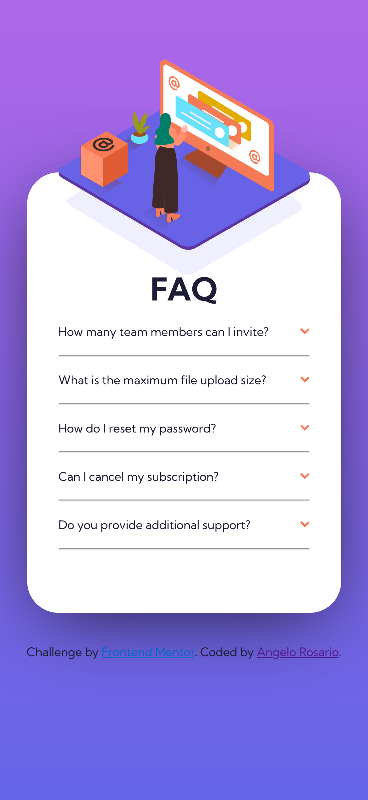
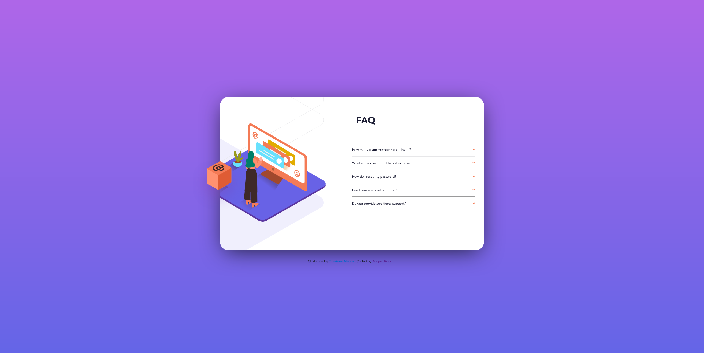

# Frontend Mentor - FAQ accordion card solution

This is a solution to the [FAQ accordion card challenge on Frontend Mentor](https://www.frontendmentor.io/challenges/faq-accordion-card-XlyjD0Oam). Frontend Mentor challenges help you improve your coding skills by building realistic projects. 

## Table of contents

- [Overview](#overview)
  - [The challenge](#the-challenge)
  - [Screenshot](#screenshot)
  - [Links](#links)
- [My process](#my-process)
  - [Built with](#built-with)
  - [What I learned](#what-i-learned)
  - [Continued development](#continued-development)
  - [Useful resources](#useful-resources)

## Overview

### The challenge

Users should be able to:

- View the optimal layout for the component depending on their device's screen size
- See hover states for all interactive elements on the page
- Hide/Show the answer to a question when the question is clicked

### Screenshot




### Links

- Solution URL: [Github](https://github.com/Sengsith/faq-accordian-card)
- Live Site URL: [Netlify](https://eclectic-lollipop-450a0a.netlify.app/)

## My process

My workflow for this project was to do the markup, create custom properties, and do the general styling all in that order. I decided to try to do the bonus challenge for this project which was to complete it without using JS.

### Built with

- Semantic HTML5 markup
- CSS custom properties
- Flexbox
- CSS Grid
- Mobile-first workflow

### What I learned

I learned about how to get around a challenge without using JS. In this project, it was using the ```tabindex``` property within my h2 tags:

```html
<h2 tabindex="1"> ... </h2>
```

This allows the element to be clickable but also allows the element to be tabbed through if needed.


### Continued development

The most trouble I had was figuring out how to position the illustrations mainly on the desktop version. Especially with the interaction between the box, and the main woman illustration. I used overflow to cut off the illustration, but had trouble keeping the box on the the outside of my main card container. I need to clean up my CSS going forward especially learning more about the ```position``` property.


## Author

- Website - [Frontend Mentor](https://www.frontendmentor.io/profile/Sengsith)
